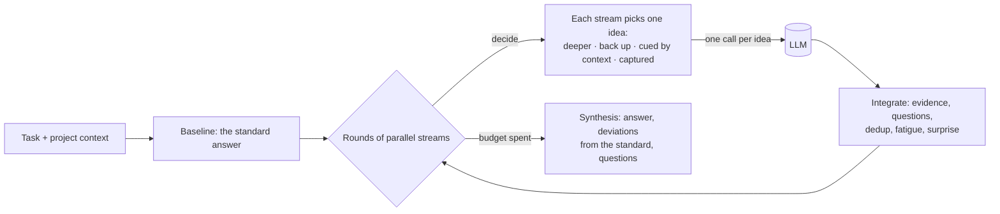

# widethink

**Brain-inspired wide thinking for LLMs** — a harness that notices where the
standard solution does not fit *this particular user*.

[](https://github.com/egor-gamedev/widethink/actions/workflows/ci.yml)
[](pyproject.toml)
[](LICENSE)
[](ROADMAP.md)

[Русская версия](README.ru.md)

---

Ask a model to "add JWT authentication to our API" and it answers with the
textbook: 15-minute access tokens, rotating refresh tokens. Correct — unless
your technicians spend four days in basements without coverage, share tablets
from a depot pool, and your policy says access must be revoked within an hour.
All of that is in the project. The model never looks: it picks the solution most
strongly associated with the wording of the request, and nothing in it forces a
look to the side.

widethink sits between the user and the model. The model stays as it is; the
harness decides **what the model thinks about at each step** — the way the
thought stream of a [digital brain](docs/mechanisms.md) does it: a tree of
thoughts that goes deeper by weighted lottery, gets bored of repeating itself,
fades with depth, returns to the level above, is captured by surprises, and
starts half of its new branches from details of the user's context.

## How it works



| Mechanism | What it does in the harness |
|---|---|
| Lottery selection | The next idea is drawn with weight `(link × freshness × value pull)²` — strong links win more often, not always |
| Satiation | A branch whose proposals repeat what the tree already holds gets "bored" and closes |
| Inhibition of return | Ideas already considered are shown to the model and their duplicates pruned |
| Fading | Strength ×0.86 per level; weak and deep thoughts propose less and stop sooner |
| Value pull | Ideas that matter to *this* user are favoured about 20:1, bad ones still considered sometimes |
| Capture | A contradiction or unexpected fact becomes the very next thought |
| Context cueing | New branches start from a file, a policy, a sentence of the user: "what does this imply?" |
| Questions | What the context cannot settle becomes a question for the user |

Every mechanism and its constants come from the brain; see
[docs/mechanisms.md](docs/mechanisms.md). The architecture is in
[docs/architecture.md](docs/architecture.md).

## Quick start

```bash
pip install "widethink[anthropic]"        # or [openai], or [all]
```

Try it without any API key — a scripted model plays the JWT scenario above while
the real harness does the thinking:

```bash
git clone https://github.com/egor-gamedev/widethink && cd widethink
pip install -e .
python examples/offline_demo.py
```

With Claude:

```python
from widethink import Thinker
from widethink.llm import AnthropicLLM

thinker = Thinker(AnthropicLLM())  # claude-opus-5 by default
result = thinker.think(
    "Add JWT-based authentication to our API",
    "./my-project",  # a directory, a file, text, or a Context
    budget=60_000,  # total tokens, all calls included
)
print(result.answer)
for d in result.deviations:
    print(f"instead of {d.standard}: {d.instead} - because {d.because}")
for q in result.questions:
    print("?", q.question)
print(result.render())  # the thought tree
```

With GPT or an open model behind an OpenAI-compatible server (vLLM, Ollama):

```python
from widethink.llm import OpenAICompatibleLLM
from widethink.embeddings import OpenAIEmbedder

llm = OpenAICompatibleLLM("qwen3-32b", base_url="http://localhost:8000/v1")
thinker = Thinker(llm, embedder=OpenAIEmbedder(base_url="http://localhost:8000/v1"))
```

From the command line:

```bash
widethink think "Add JWT-based authentication to our API" -c ./my-project --budget 60000
widethink think "..." -c ./my-project --record runs/jwt.recording.jsonl --out runs/jwt.json
widethink render runs/jwt.json --format mermaid
```

## What a run looks like

The offline demo (scripted model, real harness):

```text
[task] Add JWT-based authentication to our API. Right now every endpoint is open.   · #1 start
├── [solution] Standard solution: Short-lived JWT access tokens with rotating refresh tokens   · standard
│   ├── [solution] 15-minute access tokens   · standard
│   └── ...
├── [context] What does "README.md" imply for this task?   · #2 cued · s1.00 · supported
│   ├── [solution] Offline session bound to technician and tablet   · unexplored · v+0.9
│   └── [surprise] 15-minute tokens would lock technicians out for their whole trip   · #4 captured · ⚡
│       ├── ❓ What is the longest trip without coverage that the app must support?
│       ├── [solution] Offline grace period with re-validation on sync   · #6 association · s0.86
│       └── [solution] Encrypt local data with a key that expires   · #8 return · s0.86
├── [solution] Short-lived access tokens with refresh token rotation   · unexplored · v+0.3
├── [context] How do technicians reach the API in the field?   · #3 association · ✗ bored
│   ├── [solution] Offline session bound to technician and tablet   · pruned: duplicate of n12
│   └── [context] How long must offline access last?   · pruned: duplicate of n13
├── [context] Are tablets personal or shared?   · #5 return · supported
│   ├── [solution] Bind sessions to the technician, sign in on each check-out   · #7 association
│   └── [solution] Wipe local data on check-in   · #9 return
└── ...
```

A detail of the README cued a branch, which ran into a surprise that captured
the next thought and produced a question for the user; a branch that only
repeated what was already found got bored and closed; the textbook solution was
left unexplored. The final answer lists each departure from the standard with
its reason. The full tree as a diagram: [docs/example-tree.md](docs/example-tree.md).

## The Hidden Requirements benchmark

The claim has to be measured, at an **equal token budget** against strong
baselines — so the repository includes a benchmark of tasks whose standard
solution is wrong for the user in the context, plus control tasks where it is
right (inventing requirements counts against a method).

```bash
widethink bench validate
widethink bench run --solver direct --solver broad --solver best-of-n --solver widethink \
    --budget 60000 --judge-provider openai --judge-model <model> --out results/run.jsonl
widethink bench report results/run.jsonl
```

Methodology — task design, judge validation, statistics, contamination canary:
[docs/benchmark.md](docs/benchmark.md). The benchmark currently has five exemplar
tasks; version 1 (60–100 validated tasks) is Phase 2 of the [roadmap](ROADMAP.md).

## Status

**Alpha, research code.** The architecture, every mechanism, the providers, the
budget accounting and the benchmark harness are implemented and tested (202
tests, 97% coverage, strict typing). There are **no results yet**: whether wide
thinking beats plain models at the same budget is exactly what the
[roadmap](ROADMAP.md) sets out to measure, with a pre-registered analysis and
controls. Until then, treat this as an instrument, not a claim.

## Project layout

```text
src/widethink/      the library: engine, stream, mechanisms/, llm/, embeddings/, memory/, bench/
benchmark/tasks/    Hidden Requirements benchmark tasks (CC BY 4.0)
docs/               architecture, mechanisms, benchmark methodology, related work, ADRs
examples/           offline demo, Claude and OpenAI-compatible quick starts
tests/              unit and integration tests (no network needed)
```

## Contributing

Issues and pull requests are welcome — especially new benchmark tasks. See
[CONTRIBUTING.md](CONTRIBUTING.md) for the development setup and the checks every
change must pass.

## Citation

If you use widethink or the benchmark, please cite it (see
[CITATION.cff](CITATION.cff)):

```bibtex
@software{widethink,
  title  = {widethink: brain-inspired wide thinking for LLMs},
  author = {Egor},
  year   = {2026},
  url    = {https://github.com/egor-gamedev/widethink}
}
```

## License

Code: [Apache 2.0](LICENSE). Benchmark data: [CC BY 4.0](benchmark/LICENSE.md).
