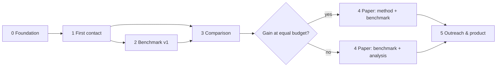

# Roadmap

This is the working plan of the project: what we want to show, in which order,
how we will know each step is done, and where we decide whether to continue or
change course. Dates are estimates for one person working steadily; they are
revised at every phase boundary.

## Thesis

Language models choose the solution most strongly associated with the wording
of a request — the textbook one. When a particular user needs something else
(tokens that work offline for days, prices that must never leak between
customers, deletion that must really erase), the model does not notice: nothing
in it forces a look to the side.

**Falsifiable claim.** A harness that steers the model's thinking with the
mechanisms of the digital brain's thought stream — a tree of thoughts with
lottery selection, satiation, inhibition of return, fading, value pull, capture
by surprise, and new branches cued by details of the user's context — notices
hidden, user-specific requirements **more often than the same model alone and
than standard test-time-compute methods at the same token budget**, without
inventing requirements where there are none.

| | Metric | Definition |
|---|---|---|
| Primary | Hidden-requirement recall | Share of hidden requirements an answer notices or asks about |
| Secondary | Addressed rate | Share of hidden requirements the proposed solution actually handles |
| Guardrail | Control precision | Share of control tasks answered with the standard solution and no invented requirements |
| Guardrail | Inventions per task | Requirements asserted about the user without support in the context |
| Cost | Tokens per task | Input + output tokens of all calls, cached input included (also reported: output tokens, USD) |

The comparison is always at an **equal budget** — the first question any lab
asks is whether a plain model with the same number of tokens would do as well.

## Phases at a glance

| Phase | Version | Goal | Estimate |
|---|---|---|---|
| 0. Foundation | 0.1 | Architecture, mechanisms, providers, benchmark harness, CI | done |
| 1. First contact | 0.2 | Reliable runs on real models; calibration; cost profile | weeks 1–3 |
| 2. Benchmark v1 | 0.3 | 60–100 validated tasks, validated judge, frozen release | weeks 3–9 |
| 3. Honest comparison | 0.4 | Equal-budget curves vs strong baselines, ablations | weeks 9–13 |
| 4. Publication | 1.0 | arXiv paper, leaderboard, citable benchmark, demos | weeks 13–17 |
| 5. Outreach & product | 1.x | Researchers, programs; a review tool that stands on its own | ongoing |

---

## Phase 0 — Foundation (done: v0.1.0.dev0)

**Delivered**

- Architecture of the harness: engine with deterministic rounds of parallel
  streams, explicit thought tree with provenance, synthesis with deviations and
  questions ([docs/architecture.md](docs/architecture.md)).
- Every brain mechanism as a separate, tested unit with its constants derived
  from the brain ([docs/mechanisms.md](docs/mechanisms.md)); `ThinkConfig.without()`
  switches each off for ablations.
- Providers: Claude (Anthropic SDK, structured output, prompt caching, server-side
  fallback), OpenAI and any OpenAI-compatible server (vLLM, Ollama) for open models,
  deterministic scripted model, record/replay for exact reproduction.
- Equal-budget accounting: normalized token usage across providers, failed calls
  counted, synthesis reserved while thinking.
- Benchmark harness: task schema with controls and canary, solvers (direct,
  reasoning effort, broad prompt, best-of-N, widethink), LLM judge, resumable
  runner, report with bootstrap intervals; five exemplar tasks.
- CLI, offline demo, CI on three OSes and four Python versions, strict typing,
  215 tests at 97% coverage.

**Exit criteria (met):** CI green; offline demo shows every mechanism; a full run
is reproducible from a recording.

## Phase 1 — First contact with real models (v0.2)

**Goal:** the harness runs reliably on real models, its defaults are calibrated,
and we know what a run costs.

**Work**

1. Live smoke runs of the five exemplar tasks, first on DeepSeek (`deepseek-flash`
   with the harness, `deepseek-v4-pro` as judge and strong baseline — cheap enough
   to iterate freely), then on Claude and one open model behind vLLM or Ollama.
   Every call is recorded (`--record`), so any run can be replayed for free. The
   procedure is in [docs/experiments.md](docs/experiments.md).
2. Prompt iteration on a **dev split only**. Prompts are versioned
   (`PROMPTS_VERSION`); nothing is tuned on tasks that will be reported.
3. Embedder calibration: collect idea pairs from real trees, label them
   duplicate / related / different, choose thresholds per embedder
   (text-embedding-3-small, a local sentence-transformer, the hashing fallback).
4. Defaults: depth versus breadth (`max_depth`, `max_thoughts`, `parallel`,
   candidates per step) on dev tasks; inline versus separate critic; focused
   versus full reinstatement.
5. Cost profile: tokens per thought, cache hit rate of the system prompt,
   structured-output failure rate, wall-clock time per run.
6. Tooling: a self-contained HTML viewer for thought trees; live progress in the
   CLI with the tree growing.
7. Recorded fixtures from live runs for provider contract tests (the opt-in live
   suite in `tests/live` already exists: `WIDETHINK_LIVE_TESTS=1 pytest tests/live`).

**Exit criteria**

- Fewer than 2% failed thoughts on the dev tasks with each provider.
- Cost and latency per run known at three budgets.
- A qualitative review of 20 trees confirms the mechanisms behave as designed
  (branches close for the documented reasons, context cues lead to grounded
  findings, duplicates are pruned).

## Phase 2 — Hidden Requirements Benchmark v1 (v0.3)

**Goal:** a benchmark that others can trust and adopt — possibly more valuable
than the harness itself. Methodology: [docs/benchmark.md](docs/benchmark.md).

**Work**

1. **Coverage.** 60–100 tasks, about 70% with hidden requirements and 30%
   controls, over at least eight domains: auth and security, privacy and data
   retention, backend reliability, performance and caching, architecture,
   frontend and accessibility, data and ML pipelines, infrastructure and mobile.
2. **Difficulty levels.** Evidence stated in one item; evidence that must be
   combined from two items; requirement implied, not stated.
3. **Two-person rule.** An author writes a task; an independent reviewer checks
   that the standard solution is what typical models answer, that the evidence
   really implies the requirement, and that the rubric is unambiguous.
4. **Pilot and calibration.** Run the direct baseline with three models; revise
   or drop tasks every model already solves (too easy) or none can (ambiguous).
5. **Judge validation.** Human labels for at least 20% of (task, answer) pairs
   across solvers; report Cohen's κ per verdict type; target κ ≥ 0.7 for
   "noticed", otherwise revise the rubric or the judge prompt.
6. **Release.** Dev split public; test split frozen and dated (and optionally held
   out); canary GUID in every file; datasheet; CC BY 4.0; Zenodo DOI.

**Exit criteria:** v1.0 of the benchmark is frozen, the judge's agreement with
people is measured and published, the direct baseline's scores are recorded.

## Phase 3 — Honest comparison (v0.4)

**Goal:** a result that survives the questions of a lab.

**Work**

1. **Pre-registration.** Commit the analysis plan before touching the test split:
   primary metric, budgets, models, seeds, statistical tests.
2. **Baselines at equal budget:** direct answer; reasoning mode at high effort;
   "think broader" prompt; best-of-N with self-selection; universal
   self-consistency; Tree of Thoughts (breadth-first with value pruning); parallel
   reasoning with synthesis; a diversity prompt in the style of Verbalized Sampling.
3. **Budget curves.** Three or more budget levels (for example 1×, 4× and 16×
   the cost of a direct answer); plot recall against tokens for every method —
   the test-time-compute scaling view labs use.
4. **Models.** At least two frontier model families and one open model.
5. **Statistics.** At least three seeds per configuration; bootstrap intervals
   over tasks; paired tests against the strongest baseline with Holm
   correction; effect sizes, not only p-values.
6. **Ablations.** Every mechanism off in turn (`ThinkConfig.without`), plus
   "context cueing only" to test whether a simpler method carries the gain.
7. **Error analysis.** Categorize misses and inventions; publish examples.

**Decision point.**

- *Gain*: widethink beats the strongest baseline at one or more budget levels,
  with the control guardrail within 5 points of the baseline → Phase 4 as
  "method + benchmark".
- *No gain*: publish the benchmark with the negative result and the ablation
  analysis — a benchmark on which current methods fail is itself a contribution —
  and simplify the method to what the ablations support.

## Phase 4 — Publication (v1.0)

- arXiv paper: problem, benchmark and its validation, method, equal-budget
  results, ablations, limitations, cost.
- Public leaderboard with a submission format (solver outputs + usage).
- PyPI 1.0 with a stable API; benchmark on Zenodo (DOI) and Hugging Face.
- Demos on real open-source repositories (security and architecture reviews),
  each with its recorded run and rendered thought tree.
- A write-up of the idea with the JWT example for a general technical audience.

## Phase 5 — Outreach and product

- **Research.** Send the paper and benchmark to researchers working on reasoning
  and test-time compute; offer the benchmark as an evaluation; apply to fellowship
  and residency programs; submit to workshops on reasoning and evaluation.
  Labs consider published results, not unsolicited ideas — the benchmark and
  the numbers are the introduction.
- **Product** (independent of lab interest): an architecture and security review
  that comments on pull requests with requirements the repository implies but the
  change ignores; an MCP server so any agent can call wide thinking as a tool.

## Research directions beyond 1.0

- **Perception through tools:** run tests, type checkers and linters as the
  harness's senses; a failing check becomes a surprise that captures attention.
- **Memory and sleep:** evaluate whether findings remembered across sessions help
  on related tasks, and what offline consolidation contributes.
- **Learned mechanisms:** fit the value critic and selection parameters from
  feedback; train the stream's decisions with reinforcement learning.
- **Distillation:** use harness traces to teach a model to think widely natively —
  the form in which labs would adopt the idea.

## Risks

| Risk | Mitigation |
|---|---|
| No gain at equal budget | Budget curves and ablations from the start; the benchmark is a contribution either way; simplify to what works |
| Re-reading the context in every step makes the harness expensive under a total-token budget | Focused reinstatement of three items; prompt caching of the constant prefix; report output tokens and cost next to total tokens |
| The judge is biased or unreliable | Per-requirement rubric, judge from a different model family, human validation with κ, published judge prompt version |
| Tasks are ambiguous, too easy or too hard | Two-person review, pilot with three models, difficulty levels |
| Contamination of the benchmark | Canary GUID, dated releases, optionally a held-out test split |
| Prompt overfitting to the evaluation | Tune on dev only; freeze and version prompts before the test split |
| The harness invents requirements | Control tasks as a guardrail metric; synthesis deviates only with evidence |
| Cost of experiments | Record and replay, caching, batch APIs for baselines, ablations on a subset |
| Provider API drift | Provider-neutral interface, recorded contract tests, pinned SDK ranges |

## Engineering standards

- Semantic versioning; `0.x` may change the API; every change goes into
  [CHANGELOG.md](CHANGELOG.md).
- Every pull request: lint, format, strict type check, tests on Linux, macOS and
  Windows, coverage at or above 85% (currently 97%).
- Architectural decisions are recorded as ADRs in [docs/adr](docs/adr).
- Results in the paper are reproducible from committed recordings, configurations
  and prompt versions.

## Next steps

- [ ] Create the GitHub repository, push, enable branch protection and CI.
- [ ] Register the PyPI trusted publisher for the release workflow.
- [ ] Run the offline demo; run the first live task with `--record`.
- [ ] Write ten more dev tasks in two new domains.
- [ ] Calibrate the embedder thresholds on pairs from the first live trees.
