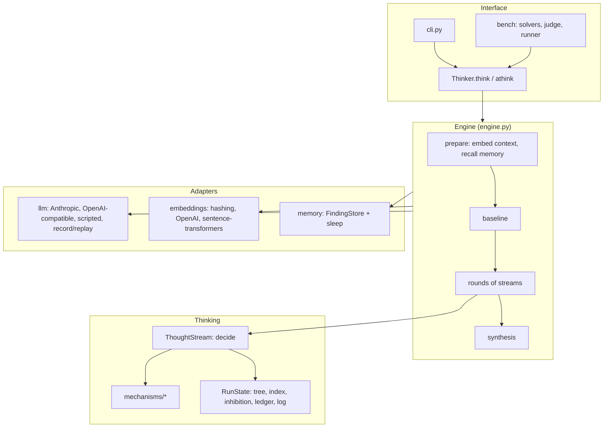

# Architecture

widethink is a harness between the user and a language model. The model stays
as it is; the harness decides **what the model thinks about at each step**,
keeps the tree of thoughts, opens parallel branches, closes the ones that got
boring, returns to the level above, and finally turns the tree into an answer.

## Layers



Dependencies point downward only: mechanisms know nothing about models,
providers know nothing about thinking, and the engine is the only place where
the two meet.

## Modules

| Module | Responsibility |
|---|---|
| `config.py` | `ThinkConfig`: every parameter, with its origin in the brain; `without()` for ablations |
| `context.py` | The user's context as items; loading projects; chunking; digests |
| `tree.py` | `ThoughtTree` / `ThoughtNode`: ideas with provenance, status and outcome |
| `mechanisms/` | Pure units: selection lottery, fatigue, fade, value pull, inhibition, capture, emergence |
| `stream.py` | `ThoughtStream`: one line of thought deciding its next focus |
| `state.py` | `RunState`: what the streams of a run share |
| `engine.py` | `Thinker`: the run's phases, rounds, integration of thoughts, synthesis |
| `prompts.py` | Versioned prompt templates |
| `schemas.py` | What the model returns at each step (strict JSON schemas) |
| `semantic.py` | Vector memory of a run: nearest neighbours of ideas and context items |
| `budget.py` | `Budget`, `Ledger`, `Pricing`: equal-budget accounting |
| `events.py` | Events for live display, logs and analysis |
| `result.py` | `ThinkResult`: answer, deviations, questions, the tree, usage, metadata |
| `render.py` | Text and Mermaid renderings of the tree |
| `llm/` | Provider-neutral interface and providers; structured output with retries; record/replay |
| `embeddings/` | Embedders with their own similarity thresholds |
| `memory/` | Findings across sessions; offline consolidation ("sleep") |
| `bench/` | The Hidden Requirements benchmark |
| `cli.py` | The `widethink` command |

## Life of a run

1. **Prepare.** The task and every context item are embedded. Each item gets a
   cue weight — its salience times its relevance to the task — so that details
   that matter are more likely to prompt a thought. With memory enabled, findings
   of past sessions that are close to the task are recalled.
2. **Baseline.** One call asks for the answer a model gives without widening. Its
   approach and key decisions enter the tree as already considered: the streams
   will not spend budget re-deriving the template, and proposals that repeat it
   are pruned.
3. **Think, in rounds.** Until the budget, the thought limit or the ideas run out:

   ```mermaid
   sequenceDiagram
     participant E as Engine
     participant S0 as Stream 0
     participant S1 as Stream 1
     participant M as Model
     E->>S0: decide()
     S0-->>E: focus A (claimed, visible to S1)
     E->>S1: decide()
     S1-->>E: focus B
     par concurrent calls
       E->>M: expand A (focus, path, 3 context items, already considered)
       E->>M: expand B
     end
     M-->>E: thought A + proposals
     M-->>E: thought B + proposals
     E->>E: integrate A, then B (evidence, questions, dedup, fatigue, surprise)
   ```

   *Decide* is synchronous and draws from each stream's own seeded generator;
   *call* is the only concurrent phase; *integrate* runs in a fixed order.
4. **Synthesize.** The most important findings (by value, evidence, resolution
   and surprise), the open questions and the cited context go to one final call,
   which writes the answer and states every deviation from the standard solution
   with the ids of the findings behind it.

## One thought

The expansion call receives, in its **system prompt** (constant for the run and
therefore cacheable): the rules, the task and an index of the context. In the
**user message** (changing every step): the path from the task to the focus, the
focus and why it was chosen, the reinstated context items, and the list of
already-considered ideas. It returns:

| Field | Used for |
|---|---|
| `elaboration` | The thought itself; shown to the synthesis |
| `evidence` | Quotes from the context; only ids that exist are kept |
| `resolution` | Whether the context supports, contradicts or leaves open the idea |
| `question` | Kept only when unresolved and relevant; becomes a question for the user |
| `surprise` | Feeds the stream's capture monitor |
| `next` | Proposals: embedded, deduplicated, scored, added as children |

## Data model

A `ThoughtNode` records how the idea came up (`origin`: task, baseline,
proposal, cued, captured, recalled), why a stream turned to it (`why`), when and
by which stream it was thought (`step`, `stream`), at what strength, what it
found (`elaboration`, `evidence`, `resolution`, `question`, `surprise`) and how
its branch ended (`closed_reason`: bored, exhausted, too deep, nowhere) — or that
it was pruned as a duplicate of another node (`duplicate_of`). Node ids are
sequential (`n0`, `n1`, ...) so trees are stable across replays.

## Concurrency and determinism

Streams share one tree and run in one event loop. All shared state is mutated
only in the synchronous *decide* and *integrate* phases, in a fixed stream
order, so no locks are needed and streams see each other's claims at once — a
stream never picks an idea another stream is already thinking about, and ideas
thought by one stream inhibit their duplicates for all.

Given a seed and a deterministic model (a scripted one, or a replay of a
recording), a run is exactly reproducible, including with parallel streams: the
interleaving is defined by rounds, not by network timing.

## Budget accounting

Every call — including failed and retried attempts — is recorded in the
`Ledger` with its purpose, step, stream and the model that answered. Usage is
normalized across providers: `input_tokens` counts all prompt tokens processed,
cached ones included. Before each round the engine checks that the spent tokens,
a conservative estimate of the round (the largest step seen so far) and a
reserve for the synthesis fit the `Budget`; the reserve guarantees that thinking
never starves the final answer. Embedding tokens are reported separately and do
not count against the budget (see ADR 0004).

## Error handling

- Transport, authentication and invalid-request errors propagate: they are
  configuration problems, and hiding them would waste budget.
- Content-level failures of a thought (invalid JSON after a retry, truncation,
  refusal) mark the node `failed`, are billed, and thinking goes on.
- A failed synthesis falls back to the baseline answer with a warning; the tree
  is never lost.
- Hooks that raise are logged and ignored: observers must not break a run.

## Extension points

| To add | Implement |
|---|---|
| A model provider | `LLM` protocol: `name` and `async generate(LLMRequest) -> LLMResponse` |
| An embedder | `Embedder` protocol: `name`, thresholds and `async embed(texts)` |
| A live observer | A hook `Callable[[Event], None]` passed to `Thinker(hooks=...)` |
| A benchmark baseline | `Solver` protocol: `name` and `async solve(task, budget, seed)` |
| A mechanism variant | A pure function in `mechanisms/`, a switch in `ThinkConfig`, a call in `stream.py` |

## Privacy

The context — possibly private code — is sent to the model provider you
configure. Recordings and saved results contain prompts and answers; the
repository ignores `runs/`, `results/` and `*.recording.jsonl` so they are not
committed by accident. Use a local model through an OpenAI-compatible server to
keep everything on your machine.
