# Example thought tree

The tree of the offline demo (`python examples/offline_demo.py --mermaid`, seed 8):
a scripted model plays the JWT scenario from the README, the harness is real.

Dotted edges lead to ideas that were never thought about - unexplored or pruned
as duplicates. Numbers are the order in which ideas were thought.

```mermaid
flowchart TD
  classDef task fill:#1f2937,color:#fff,stroke:#111827;
  classDef standard fill:#e5e7eb,color:#374151,stroke:#9ca3af;
  classDef context fill:#dbeafe,color:#1e3a8a,stroke:#1d4ed8;
  classDef solution fill:#dcfce7,color:#14532d,stroke:#15803d;
  classDef risk fill:#fee2e2,color:#7f1d1d,stroke:#b91c1c;
  classDef surprise fill:#fef3c7,color:#78350f,stroke:#b45309;
  classDef recalled fill:#ede9fe,color:#4c1d95,stroke:#6d28d9;
  classDef unexplored fill:#ffffff,color:#6b7280,stroke:#d1d5db,stroke-dasharray:4 3;
  classDef pruned fill:#f9fafb,color:#9ca3af,stroke:#e5e7eb,stroke-dasharray:2 2;
  n0["#1 Add JWT-based authentication to our API. Right now every endpoint is o…"]
  class n0 task;
  n1["Standard solution: Short-lived JWT access tokens with rotating refresh…"]
  n0 --> n1
  class n1 standard;
  n2["15-minute access tokens"]
  n1 --> n2
  class n2 standard;
  n3["Refresh token rotation"]
  n1 --> n3
  class n3 standard;
  n4["RS256 signatures"]
  n1 --> n4
  class n4 standard;
  n5["Tokens stored in secure storage"]
  n1 --> n5
  class n5 standard;
  n6["#2 What does #quot;README.md#quot; imply for this task?"]
  n0 --> n6
  class n6 context;
  n12["Offline session bound to technician and tablet"]
  n6 -.-> n12
  class n12 unexplored;
  n13["How long must offline access last?"]
  n6 -.-> n13
  class n13 unexplored;
  n14["#4 15-minute tokens would lock technicians out for their whole trip<br/>❓ What is the longest trip without coverage that the app must support?"]
  n6 --> n14
  class n14 surprise;
  n17["#6 Offline grace period with re-validation on sync"]
  n14 --> n17
  class n17 solution;
  n18["#8 Encrypt local data with a key that expires"]
  n14 --> n18
  class n18 solution;
  n7["Short-lived access tokens with refresh token rotation"]
  n0 -.-> n7
  class n7 unexplored;
  n8["#3 How do technicians reach the API in the field?"]
  n0 --> n8
  class n8 context;
  n15["Offline session bound to technician and tablet"]
  n8 -.-> n15
  class n15 pruned;
  n16["How long must offline access last?"]
  n8 -.-> n16
  class n16 pruned;
  n9["#5 Are tablets personal or shared?"]
  n0 --> n9
  class n9 context;
  n19["#7 Bind sessions to the technician, sign in on each check-out"]
  n9 --> n19
  class n19 solution;
  n20["#9 Wipe local data on check-in"]
  n9 --> n20
  class n20 solution;
  n10["#11 What are the rules for ending access?"]
  n0 --> n10
  class n10 context;
  n25["Revocation list pushed to tablets on reconnect"]
  n10 -.-> n25
  class n25 unexplored;
  n26["Choose between uninterrupted offline work and one-hour revocation"]
  n10 -.-> n26
  class n26 unexplored;
  n27["Revocation within an hour is impossible for tablets that are offline"]
  n10 -.-> n27
  class n27 unexplored;
  n11["Asymmetric signing so the app can verify tokens itself"]
  n0 -.-> n11
  class n11 unexplored;
  n21["#10 What does #quot;app/models.py#quot; imply for this task?"]
  n0 --> n21
  class n21 context;
  n22["Bind sessions to the technician, sign in on each check-out"]
  n21 -.-> n22
  class n22 pruned;
  n23["Wipe local data on check-in"]
  n21 -.-> n23
  class n23 pruned;
  n24["#12 What does #quot;docs/security-policy.md#quot; imply for this task?"]
  n0 --> n24
  class n24 context;
  n28["Revocation list pushed to tablets on reconnect"]
  n24 -.-> n28
  class n28 pruned;
  n29["Choose between uninterrupted offline work and one-hour revocation"]
  n24 -.-> n29
  class n29 pruned;

```

